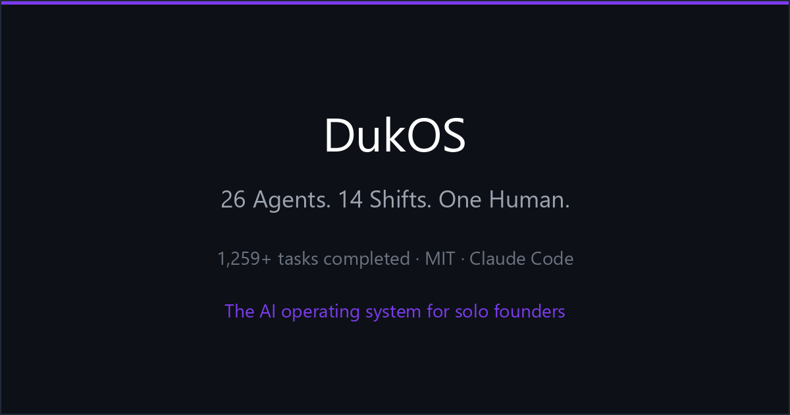

# DukOS 🦆

<p align="center">
  
</p>

> **Autonomous AI agents that run your startup's operations on a schedule — while you sleep.**
> Research, marketing, growth, content, outreach, admin. You set the direction. DukOS does the shift work.

[](LICENSE)
[](https://claude.ai/code)
[]()

---

## What DukOS is

DukOS is an **autonomous, scheduled, multi-agent operating system** for solo founders. It runs a team of two dozen specialized AI agents against your projects — on a clock, unsupervised — and you wake up to finished work and a morning briefing.

It is built on **Claude Code**. It has been running a real solo-founder portfolio in production, every night, for months. It is not a demo.

```
One command → agents work scheduled shifts → commits, reports, and a briefing — every morning.
```

The mental model is simple: **it's a night shift for your business.** You're the founder. The agents are the team that keeps working after you close the laptop.

### What DukOS is *not*

Being clear about this saves everyone time:

- **Not a coding-agent tool.** If you want a library of dev subagents to call interactively, use [wshobson/agents](https://github.com/wshobson/agents) or [ruvnet/ruflo](https://github.com/ruvnet/ruflo) — they're excellent at that. DukOS is for *business operations*, not writing your code.
- **Not a dashboard you watch.** There is no GUI you sit in front of. Agents run headless, on a schedule. The output is files and commits, not a live view.
- **Not a chatbot or a single agent.** It's a coordinated team that hands work off across time.
- **Not a SaaS.** It runs on your machine, with your API key, your Git repo. No server, no database, no vendor lock-in.

DukOS deliberately occupies a lane the big agent projects leave empty: **autonomous business operations on a schedule.** That's the whole point.

---

## How it works

Each **shift**, DukOS launches a set of agents in parallel. Every agent reads a shared task board, picks its highest-priority task, does the work, commits to Git, and stops. Agents never share memory — they communicate **only through files.** That's intentional: parallel agents that never share memory cannot deadlock.

| DukOS Concept | What It Is |
|---|---|
| **The Pond** | The core orchestration logic that coordinates every agent |
| **Shifts** | Scheduled time windows — agents hand work off across them via files |
| **Skills** | External tools and slash commands imported into an agent's context |
| **The Bill** | `run.sh` — the one command that dispatches a shift |

Because everything is files and Git, **crash recovery is free**: every agent writes a checkpoint before starting a task, so a crash loses at most one task (see [Crash Recovery](#crash-recovery)).

---

## Quick Start

**Requirements:** Claude Code CLI, Git, Node.js, an Anthropic API key. A Bash shell (Git Bash on Windows, or WSL).

```bash
# 1. Clone
git clone https://github.com/duk-os/duk-os.git && cd duk-os

# 2. Run setup
bash tools/setup.sh

# 3. Add your API key
cp config/.env.example .env
# → edit .env: add ANTHROPIC_API_KEY

# 4. Pick a template + power mode
bash tools/select-mode.sh

# 5. Launch a shift
bash run.sh
```

First run takes a few minutes. After that, schedule it (cron / Task Scheduler) and read the morning report.

---

## The agents

DukOS's reference build runs roughly two dozen specialized agents. Each is a single Markdown prompt in `agents/prompts/`. They run as separate `claude --print` processes — no shared memory, no chain-of-thought loops. Each reads a task, does it, commits, stops.

| Agent | Role | What it does each shift |
|---|---|---|
| **orchestrator** | Shift coordinator | Reads the task board, assigns priorities, writes the morning briefing |
| **research** | Market intelligence | Web research, competitor analysis, trend reports |
| **growth** | Experiments | A/B test specs, funnel analysis, launch strategy |
| **competition-research** | Competitive intel | Deep competitor teardowns, gap analysis |
| **marketing** | Growth & channels | Social copy, campaign briefs, channel execution |
| **content** | Content production | Threads, blog posts, newsletters, launch copy |
| **copywriter** | Conversion copy | Landing-page copy, email sequences, CTAs |
| **seo** | Search optimization | Schema markup, keyword research, on-page audits |
| **aso** | App Store optimization | Store listings, screenshots, keyword targeting |
| **tiktok** | Short-form video | Hook writing, trend research, content calendars |
| **community** | Reddit / Discord | Community posts, engagement, draft replies |
| **outreach** | Cold outreach | Personalized sequences, follow-ups, prospect research |
| **builder** | Software developer | Feature specs, code, build tasks |
| **gamedev** | Game developer | Game design docs, playtesting notes |
| **qa** | Quality assurance | Code review, deploy verification, regression checks |
| **security** | Security / audit | Audits the system each morning shift — secret-leak scans, prompt-injection checks, threat-model triage |
| **data** | Analytics | Daily reports, KPI tracking, anomaly detection |
| **portfolio-analyst** | Finance | Investment research, market events, portfolio updates |
| **admin** | Operations | Shift scoring, daily summaries, task cleanup |
| **review** | Audit | Post-shift change logs, system-file audits |
| **assistant** | Briefings | Morning / evening briefs delivered to your messaging app |
| **habit / habit-morning / habit-review** | Personal OS | Routine tracking, daily focus, weekly review |

The roster is **not fixed.** Adding your own agent is one Markdown file — see [CONTRIBUTING.md](CONTRIBUTING.md). The role library is designed to grow, and community-contributed agents are welcome.

---

## Shift schedule

Agents run in coordinated shifts — never all at once. Each shift hands off to the next through written files.

| Shift | Time | Focus |
|---|---|---|
| Night 1 | 9pm | Build, content, research, marketing |
| Handoff | 2am | Orchestrator — processes requests, updates the board |
| Night 2 | 2:30am | Marketing, outreach, community |
| Morning | 7am | Orchestrator, admin, QA |
| Burst | 10am | Research, SEO, ASO, finance |
| Daytime | 12pm | Admin, data |
| Strategy | 1pm | Orchestrator, research, growth |
| Afternoon | 4pm | Content, marketing |
| Evening | 7pm | Review + next-day prep |

The schedule is yours to change. It lives in plain config — no agent knows what another is doing in real time.

---

## Templates

Different founders need different teams. At setup you pick a **template**, and DukOS activates the right agents for it.

| Template | Best for | Core agents |
|---|---|---|
| 🧑‍💻 **Dev Studio** | Solo devs, SaaS founders | builder, qa, research, seo, content, growth |
| 📣 **Marketing Engine** | Content creators, growth teams | marketing, seo, copywriter, content, tiktok, community |
| 🎮 **Game Studio** | Indie game devs | gamedev, aso, content, community, qa |
| 💰 **Finance & Research** | Traders, analysts | portfolio-analyst, research, data, competition-research |
| 🧘 **Founder OS** | Solo founders running everything | orchestrator, research, marketing, content, admin, habit |
| 🏗 **Full Studio** | The whole portfolio at once | everything — the flagship config |

Templates are the **honest scaling story.** You don't run a hundred agents — you run the ~15 that match what you're doing.

---

## Multi-project architecture

DukOS can run agent teams for **multiple projects in parallel.** There is no fixed agent count and no required project count.

```
Global Orchestrator
├── Project A  → its own orchestrator + the agents that project needs
├── Project B  → its own orchestrator + the agents that project needs
└── Project C  → ...
```

Each project gets the agents it actually needs — **ragged, not uniform.** A validation-stage project might need 3 agents; a launching product might need 12. You configure this in `config/settings.json`:

```jsonc
{
  "projects": [
    { "id": "my-saas",   "template": "dev-studio" },
    { "id": "my-game",   "template": "game-studio" },
    { "id": "my-brand",  "template": "marketing-engine" }
  ]
}
```

Core role prompts are **reused across projects** — the same `research.md` prompt reads `projects/my-saas/context.md` for one project and `projects/my-game/context.md` for another. You write ~20 role prompts, not one per project. The Global Orchestrator handles cross-project priorities ("the game launches Thursday — give it more agents this week").

> As you add projects, the total number of agent *instances* grows naturally. That number is something DukOS *produces* — never a target you set.

---

## Power modes & cost

DukOS runs on the Anthropic API (and optionally local models). **You pay for what you run.** Cost scales with: agents active × shifts per day × model tier.

| Mode | Agents | Model tier | Rough monthly cost |
|---|---|---|---|
| 🌱 **Starter** | ~8 | Haiku / local | <$30, or free locally |
| ⚡ **Standard** | ~15 (one template) | Sonnet | $30–150 |
| ⚡⚡ **Full** | ~24 (whole roster) | Sonnet + Haiku | $150–500 |
| ⚡⚡⚡ **Max** | Whole roster × multiple project teams | Opus + Sonnet | $500+ |

Run `bash tools/cost-estimate.sh` **before** your first launch — it shows a monthly forecast based on your config.

> ⚠️ Heavy configurations can cost **$500+/month** in API fees — you will be billed. Estimate first.
> ⚠️ DukOS is not a SaaS — you need Git, a terminal, and an API key.
> ⚠️ Rate limits apply. Built-in backoff is included; plan your shift schedule accordingly.

### Caveman Mode 🪨

A token-saving toggle. When on, agents strip all filler and write in compressed fragments.

> **Normal:** *"I have successfully completed the competitor analysis and identified three key gaps..."*
> **Caveman:** *"analysis done. 3 gaps. acting now."*

Set `"caveman_mode": true` in `config/settings.json`. Cuts verbose agent output 30–60%. Recommended for Starter mode and tight budgets. Does not affect code the agents write.

---

## Built-in skills

DukOS ships with three slash-command skills (in `skills/`) any agent (or you) can invoke:

| Skill | What it does |
|---|---|
| `/orient` | Get oriented in any codebase in under 60 seconds — what it is, the stack, recent git activity, the handful of files that matter, and loose ends |
| `/sanity-check` | Post-implementation audit — security, logic edge cases, performance, and stack-specific bugs; LOW mode (changed files) or HIGH mode (full codebase) |
| `/code-review` | Multi-agent PR review — 5 parallel reviewers, each finding confidence-scored by a judge, only 80%+ surfaced, posted as inline PR comments |

More skills from the author's toolkit are being ported into this library — contributions are welcome ([CONTRIBUTING.md](CONTRIBUTING.md)).

---

## Crash Recovery

DukOS never loses more than one task to a crash.

Every agent writes a **checkpoint** before starting any task. On restart it reads the checkpoint, runs `git status`, and resumes or restarts automatically. Git is the safety net — agents commit after every task.

```
crash → restart → agent reads checkpoint → resumes at the exact task → continues
```

No manual recovery. It's automatic.

---

## The ducks 🦆

DukOS has a brand: every agent is a duck in a costume that matches its role. The orchestrator is **The Maestro** (tuxedo, conductor's baton). The researcher is **The Detective** (trenchcoat, magnifying glass). QA is **The Inspector** (hard hat, clipboard, disapproving look).

It's deliberately a little silly — and it makes the system memorable, the docs readable, and the community fun to be part of.

### Contributor tiers

Every contributor earns a duck.

| Tier | Who |
|---|---|
| 🥚 **Hatchling** | First issue or doc fix |
| 🦆 **Dabbler** | First merged PR |
| 🌊 **Diver** | Active contributor (3+ PRs) |
| 🪶 **The Flock** | Core maintainers |
| 👑 **Head Duck** | The founder |

Top contributors can have a real duck from the founder's physical duck collection — gathered from dozens of countries — named after them. This is not a joke.

---

## Where DukOS fits

Honest positioning, because the agent space is crowded and you deserve the truth:

| You want… | Use |
|---|---|
| A library of coding subagents to call interactively | [wshobson/agents](https://github.com/wshobson/agents) |
| A sophisticated orchestration swarm for dev tasks | [ruvnet/ruflo](https://github.com/ruvnet/ruflo) |
| **Autonomous business operations that run on a schedule while you sleep** | **DukOS** |

DukOS is not trying to out-feature the orchestration platforms. It does one specific thing they don't: it runs your *business operations* — research, marketing, growth, content, outreach — unattended, on a clock.

---

## Roadmap

DukOS launches as the working system above. Everything below is **post-launch** — not in the initial release:

- Local model support (Gemma via Ollama) for a free tier
- A read-only GUI dashboard (the output stays files-first)
- An agent generator — describe a role, get a prompt
- A community agent library
- macOS / Linux parity polish

The items above are the build plan — this Roadmap section is the canonical list.

---

## License

MIT — use it, fork it, build on it. See [LICENSE](LICENSE).

## Credits

Every external repo, tool, or resource that influenced DukOS is credited in [`credits.md`](credits.md). No exceptions.

## Contributing

New agents, better prompts, cross-platform fixes, clearer docs — all welcome. See [CONTRIBUTING.md](CONTRIBUTING.md).

---

*Built by a solo founder who runs an entire project portfolio on it. Powered by Claude Code.*
*DukOS — your startup's night shift.*
